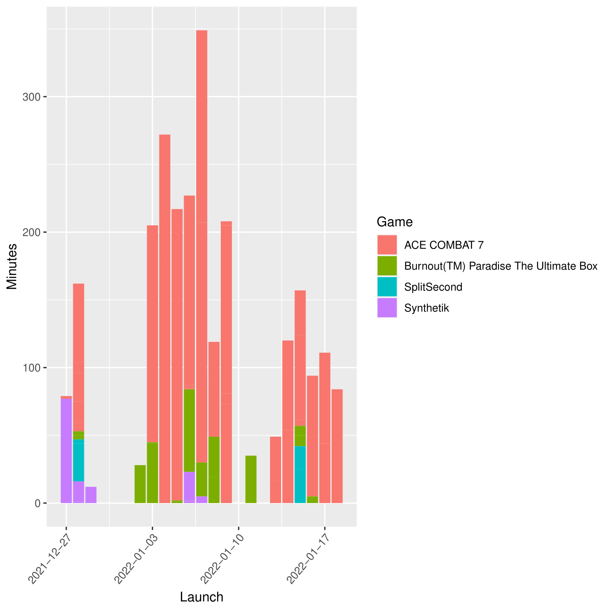

# Steam Playtime Logger
This is a small Python script to track every time a Steam game is played. It does so by tracking the title of the game and the timestamps at which it's launched and closed. These are saved on a .csv, which can be visualized as a stacked bar chart with the R script included. 

## Usage and configuration
1. Download the source code.
2. Get the index (either json or html) at https://api.steampowered.com/ISteamApps/GetAppList/v2/
3. Edit the global variable "index_path" with the path, and name you've given the index, as well as whatever extension it has.
4. Edit the global variable "csv_path" with wherever you've dropped the included CSV. If you use a different one, know that the script does not add column headers.
5. Edit the global variable "minimum_minutes" with the smallest length a session must have to be logged. By default it's 0.
6. Edit the main with however you launch Steam in your system. For example, if you use an icon, copy it's command into the process and arguments Popen launches.
7. Change the way you launch steam so this script is launched instead. Following the previous example, change the icon's command to "python /wherever_you_place_the_script/steamlogger.py"

## Non-Steam Games
Games without an AppID or path in /Steam/steamapps/common/ can have very different launch methods. This script just saves the whole line, it's up to you to find and replace it in the CSV file with the game's actual name, before applying the R script to it.
